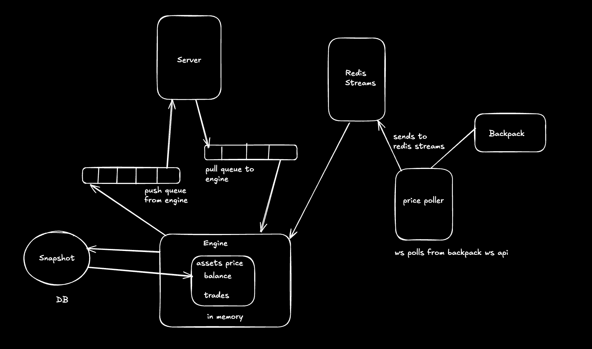
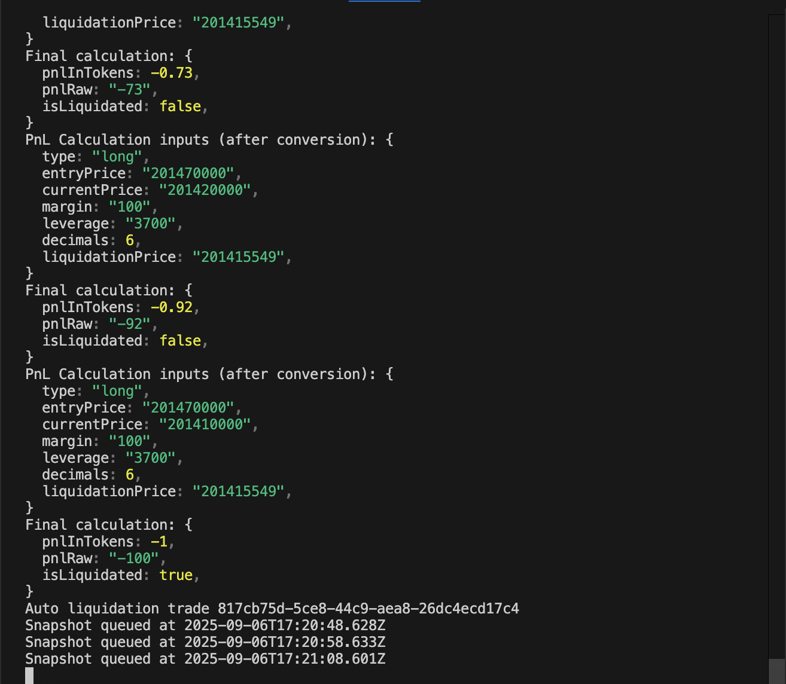
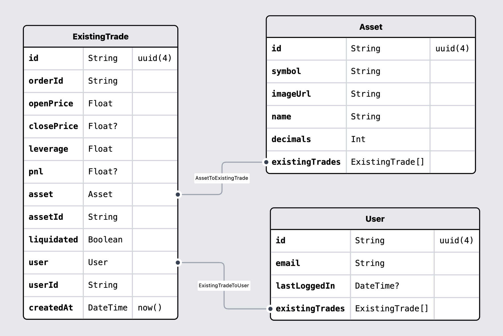
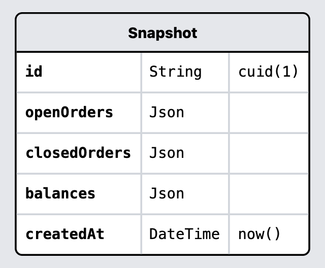

# Exness

## Demo Vid

https://github.com/user-attachments/assets/ae8db22a-bb99-4047-b900-dea197866e70

eo

## Architecture

The system is built as a set of microservices that communicate via **Redis Queues** and **Redis Streams**.
This ensures high-throughput, low-latency communication between services, while keeping the design modular and fault-tolerant.



### Components

* **Server**
  Bun.js backend that exposes HTTP APIs for user requests (balances, trades, wallet initialization).
  Communicates with the Engine using Redis **queues**.
  Performs direct reads from Main DB for authentication and asset validation.
  Includes comprehensive trade validation for margin, leverage, and asset types.

* **Engine**
  Core trading engine that:

  * Maintains in-memory state (asset prices, balances, trades)
  * Processes all trade and wallet requests from the Server (via Redis queues)
  * Consumes real-time price updates from Redis **streams**
  * **Auto-liquidates trades** when liquidation price is reached
  * Calculates liquidation prices during trade creation
  * Queues write operations to DB Processor via Redis streams
  * Restores state from snapshots on startup

* **DB Processor**
  Dedicated database write service that:

  * Consumes write operations from Redis streams
  * Handles trade creation/updates in Main DB
  * Processes snapshot data and writes to Snapshot DB
  * Records auto-liquidation events with detailed PnL information
  * Provides batch processing for high-throughput scenarios

* **Price Poller**
  Connects to Backpack WebSocket API to fetch live prices.
  Batches updates and pushes them into Redis **streams** (`price_stream`).
  Triggers auto-liquidation checks on every price update.

* **Database (PostgreSQL)**
  
  * **Main DB**: Stores users, trades, and assets using Prisma ORM
  * **Snapshot DB**: Stores periodic snapshots of engine state for recovery

* **Redis**

  * **Queues (Lists)**:

    * `server → engine`: request queue for trade/wallet operations
    * `engine → server`: response queue for results/errors
  * **Streams**:

    * `price_stream`: high-frequency price updates from poller to engine
    * `db_operations_queue`: write operations from engine to DB processor
    * `snapshot_queue`: snapshot data from engine to DB processor

### Key Features

####  **Auto-Liquidation System**
The engine automatically liquidates trades when the liquidation price is reached:

* **Real-time Monitoring**: Every price update triggers liquidation checks
* **Instant Execution**: Trades are automatically closed when liquidation conditions are met
* **Zero Return**: Liquidated users receive 0 balance (total margin loss)
* **Database Logging**: All liquidations are recorded with detailed PnL information



*Example: A long position with 3700x leverage getting auto-liquidated when SOL price dropped from 201.47 to 201.20*

####  **Trade Validation**
Comprehensive validation ensures trade integrity:

* **Margin Validation**: Must be greater than zero
* **Asset Validation**: Only SOL, ETH, BTC supported
* **Type Validation**: Only 'long' and 'short' positions allowed
* **Leverage Limits**: 1x to 100x leverage supported
* **Real-time Checks**: All validations happen before trade execution

#### **Advanced PnL Calculation**
Sophisticated profit/loss calculation with:

* **Liquidation Price Calculation**: Computed during trade creation
* **Real-time PnL Updates**: Continuous monitoring of position value
* **Partial/Complete Loss Handling**: Different logic for partial vs. complete liquidation
* **High Precision**: BigInt calculations for accurate financial operations

### Data Flow

1. **Server → Engine (RPC via Redis Queues)**
   * Server receives user requests (trade execution, wallet operations)
   * **Validates** margin, leverage, asset type, and trade type
   * Pushes request into Redis **queue** (`trade_stream`, `user_wallet_stream`) with unique response channel
   * Engine consumes, processes, and pushes results back to response queue

2. **Price Poller → Engine (Streaming via WebSocket + Redis)**
   * Poller connects to Backpack **WebSocket** feed
   * Publishes batched price updates into Redis **streams** (`price_stream`)
   * Engine consumes stream updates and **triggers auto-liquidation checks**
   * Liquidated trades are automatically closed with zero return

3. **Engine → DB Processor (Async Write Operations)**
   * Engine queues trade operations to `db_operations_queue` stream
   * Engine queues snapshots to `snapshot_queue` stream
   * **Auto-liquidation events** are queued with liquidation flags
   * DB Processor consumes from both streams concurrently
   * Separates Main DB writes (trades) from Snapshot DB writes (state recovery)

4. **Engine State & Persistence**
   * Engine holds in-memory state for ultra-low latency
   * **Liquidation prices** stored with each trade for efficient checking
   * Periodically queues snapshots every 20 seconds via Redis streams
   * On restart, Engine restores state from latest snapshot in Snapshot DB

5. **Database Operations**
   * **Server Direct Reads**: Authentication, asset validation (immediate response needed)
   * **DB Processor Writes**: Trade creation/updates, user creation, snapshots, liquidations (async)
   * **Engine Startup**: Snapshot restoration from Snapshot DB

---

## Tech Stack

* **Backend**

  * Bun.js Native Http
  * Bun Runtime
  * Redis (Queues + Streams + KV Store)
  * PostgreSQL (With Prisma ORM for main DB , Pg library for snapshots)
  * Resend (For Mailing)
  * Jest & Supertest(for testing)
  
## Backend System

* **Database Design**

  * Main Database Schema(PostgreSQL with Prisma)
  * Snapshot Database(PostgreSQL with Pg)

<h4>Main Database Schema(PostgreSQL with Prisma)</h4>

  

<h4>Snapshot Database(PostgreSQL with Pg)</h4>

  

* **Communication**

  * Redis Queues for RPC-style request/response (Server ↔ Engine)
  * Redis Streams for high-frequency market data (Poller → Engine)
  * WebSocket for external Backpack market feed

* **Trading Features**

  * **Leveraged Trading**: 1x to 100x leverage with customizable margin
  * **Auto-Liquidation**: Real-time liquidation monitoring and execution
  * **Risk Management**: Comprehensive trade validation and position limits
  * **Auth Verification**: Email verification via Resend
  * **Real-time Pricing**: Live price ingestion via Redis Streams
  * **Advanced PnL**: Sophisticated profit/loss calculation with liquidation handling
  * **Balance Management**: Real-time balance updates and margin management
  * **Trade Execution**: Instant trade settlement with sub-second latency
  * **State Persistence**: Crash-resistant snapshots to PostgreSQL
  * **Audit Trail**: Complete trade history and liquidation logging

## API Validation Rules

### Create Trade Endpoint
```typescript
POST /api/v1/trade/create
{
  "asset": "SOL" | "ETH" | "BTC",        // Required: Supported assets only
  "type": "long" | "short",              // Required: Trade Type
  "margin": number,                      // Required: Must be > 0
  "leverage": number,                    // Required: 1-100 range
  "slippage": number                     // Optional: 10-10000 (in range)) 100 means 1%
}
```

**Validation Rules:**
- Margin must be greater than zero
- Asset must be SOL, ETH, or BTC
- Type must be 'long' or 'short'
- Leverage must be between 1 and 100
- Slippage must be between 0.1% and 100% (if provided)
- User must be authenticated

**Slippage Protection:**
- Prevents trades from executing at prices worse than expected
- Value is in percentage (100 = 1%)
- Example: 
  - Slippage of 100 = 1% maximum price movement allowed
  - If price moves more than specified percentage, trade is rejected
- Optional parameter - if not provided, no slippage check is performed

**Auto-Liquidation:**
- Liquidation price calculated on trade creation
- Real-time monitoring on every price update
- Automatic trade closure when liquidation price reached
- Zero balance return on complete liquidation

### Price Management & Trade Execution

**Price Storage in Redis:**
- Engine stores latest prices in Redis KV store
- Key format: `price-{ASSET}` (e.g. `price-SOL`)
- Value format: `{ price: string, decimal: number }`
- 30-second TTL to prevent stale prices
- Example:
```json
{
    "price": "50000000000",  // Price with decimals
    "decimal": 6             // Decimal places
}
```

**Trade Price Validation Flow:**
1. **Price Update:**
   - Engine receives price updates from WebSocket
   - Stores in Redis with 30s expiry
   - Format: `redis.set(price-BTC, priceData, 'EX', 30)`

2. **Trade Request:**
   - Server checks current price from Redis KV
   - Verifies price exists and hasn't expired
   - Example: `redis.get(price-${asset})`

3. **Slippage Check:**
   - Server gets price: `priceFromRedis`
   - Engine executes at: `executionPrice`
   - Calculates deviation: `|executionPrice - priceFromRedis| / priceFromRedis * 100`
   - Rejects if deviation > allowed slippage

**Example Flow:**
```typescript
// 1. Price Update (in Engine)
const priceUpdate = {
    asset: "SOL",
    price: "20150000000",
    decimal: 6
}
await redis.set(`price-SOL`, JSON.stringify(priceUpdate), 'EX', 30)

// 2. Trade Request (in Server)
const currentPrice = await redis.get(`price-SOL`)
// Price: 201.50 USDC

// 3. Engine Execution
const executionPrice = 202.50 // USDC
const deviation = Math.abs(202.50 - 201.50) / 201.50 * 100
// Deviation = 0.497%

// 4. Slippage Check
if (deviation > allowedSlippage) {
    throw new Error("Price slippage too high")
}
```

This price management system ensures:
- Real-time price updates
- No stale prices (30s TTL)
- Price deviation protection
- Accurate slippage calculations

