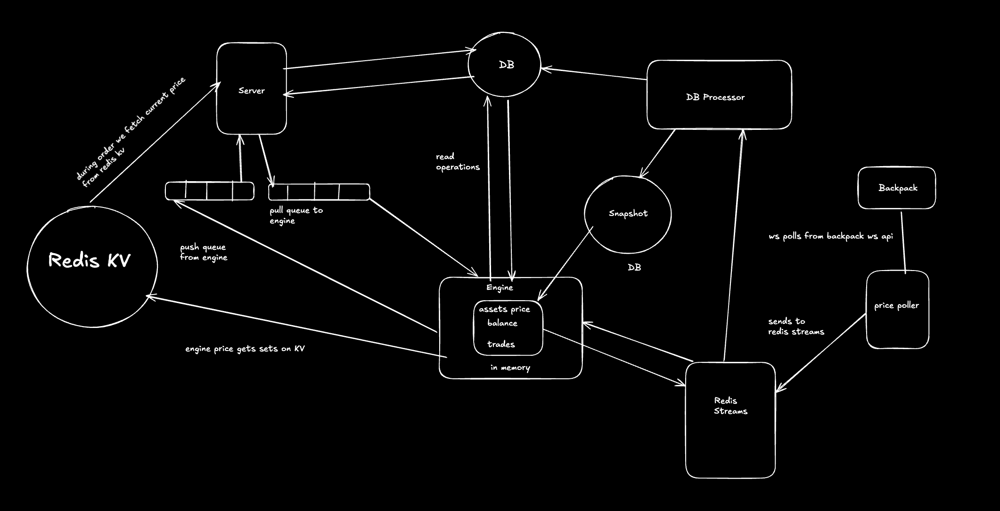

# Super 30 - Batch 2 Contset 1 (Improved microservice version of Exness)

## Architecture

The system consists of several microservices that communicate through Redis queues and pub/sub.

### Components
- **Server**: Express.js backend that handles HTTP requests and communicates with the Engine
- **Engine**: Core trading engine that processes trades and manages balances
- **Price Poller**: Service that polls price data from Backpack API
- **Database**: PostgreSQL for persistent storage
- **Redis**: Used for message queues and pub/sub communication

### Data Flow
1. Server receives trade/balance requests and pushes to Redis queues
2. Engine processes requests from queues and maintains in-memory state
3. Price poller fetches prices and publishes through Redis pub/sub
4. Engine uses price updates for PnL calculations
5. State is persisted to PostgreSQL through snapshots

## Tech Stack

- **Backend**
  - Node.js
  - Express.js
  - Redis (Queues & Pub/Sub)
  - PostgreSQL
  - Bun Runtime

- **Communication**
  - Redis Queues for asynchronous processing
  - Redis Pub/Sub for real-time updates
  - WebSocket for price streaming

- **Features**
  - Leveraged trading with customizable margin
  - Real-time price updates
  - PnL calculation
  - Balance management
  - Trade execution and settlement 

